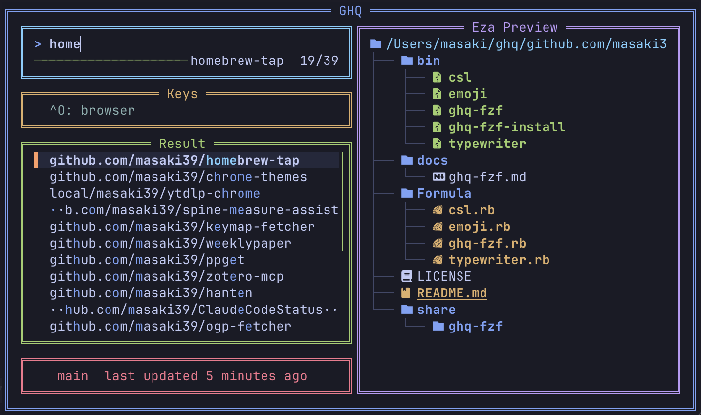

# ghq-fzf

Interactive repository picker for [ghq](https://github.com/x-motemen/ghq), powered by [fzf](https://github.com/junegunn/fzf).  
Works out of the box — no configuration required.

---



---

## Features

- **Fuzzy search** across all your ghq-managed repositories
- **File tree preview** via `eza`
- **Branch name + last updated** shown in the footer on focus
- **Open in browser** with `Ctrl-O` (uses `gh`)
- **Tokyo Night color theme** out of the box

## Requirements

The following tools are installed automatically as dependencies:

| Tool | Purpose |
|------|---------|
| [fzf](https://github.com/junegunn/fzf) 0.57+ | Fuzzy finder UI |
| [ghq](https://github.com/x-motemen/ghq) | Repository manager |
| [eza](https://github.com/eza-community/eza) | File tree preview |
| [gh](https://cli.github.com/) | Open repo in browser |

> **Note:** `Ctrl-O` (open in browser) requires `gh auth login` to be completed in advance.

## Installation

```sh
brew tap masaki39/tap
brew install masaki39/tap/ghq-fzf
ghq-fzf-install
```

Then restart your shell (or run `source ~/.zshrc`).

## Usage

After installation, two ways to launch the picker:

| Method | Default | Action |
|--------|---------|--------|
| Type command | `gv` | Open picker and `cd` into selected repository |
| Key binding | `Ctrl-G` | Same, from anywhere in the terminal |

### In-picker keys

| Key | Action |
|-----|--------|
| `Enter` | `cd` into the selected repository |
| `Ctrl-O` | Open the repository in your browser |
| `Esc` / `Ctrl-C` | Close without changing directory |

## Customization

Add these lines to `~/.zshrc` **before** the `source` line added by `ghq-fzf-install`:

```zsh
export GHQ_FZF_FUNC='repo'   # change the command name (default: gv)
export GHQ_FZF_KEY='^]'      # change the key binding  (default: Ctrl-G)
```

## Update

```sh
brew update && brew upgrade masaki39/tap/ghq-fzf
```

## Uninstall

```sh
brew uninstall masaki39/tap/ghq-fzf
```

Remove the lines added by `ghq-fzf-install` from `~/.zshrc` manually if desired.
